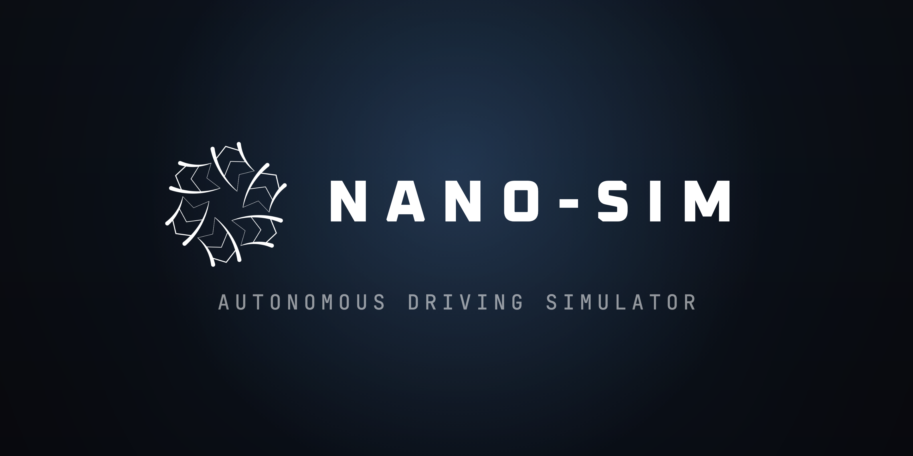

# Nano-sim Simulator

<div align="center">


</div>

<br>



<div align="center">

<br>

<a href="../../releases"></a>
&nbsp;
<a href="https://hyeokk.com/projects/nano-sim/docs"></a>

</div>

## About

Nano-sim is a Unity-based, closed-loop **autonomous driving simulator** built around a
small-scale RC car. It is made for research use — generating synthetic perception data
(RGB, segmentation, depth, 2D/3D LiDAR, IMU/GNSS), training and evaluating driving
policies, and testing perception and control in a repeatable virtual environment that
mirrors a real bench setup.

> **Release 0.1.0 — early prototype.**
> Core simulation and sensors are working. UI polish, window resizing, and in-app exit
> controls are still in progress and will arrive in later updates.

<br>

## Download

Get the latest build from the [**Releases**](../../releases) page.

| Platform | File |
| :-- | :-- |
| macOS · Apple silicon / Intel | `Nano-sim-macOS.zip` |
| Linux · x86_64 | `Nano-sim-linux.zip` |

<br>

## Install & Run

The app is **not code-signed** (research prototype), so your OS will block it the first
time you open it. This is expected — follow the steps for your platform.

### macOS

1. Unzip `Nano-sim-macOS.zip`.
2. **Right-click** (or Control-click) `Nano-sim.app` → **Open** → **Open** again.
   You only need to do this once.

<details>
<summary>macOS says <em>"Nano-sim.app is damaged and can't be opened"</em></summary>

<br>

Clear the quarantine flag in Terminal, then open it normally:

```bash
xattr -cr /path/to/Nano-sim.app
```

</details>

### Linux

1. Unzip `Nano-sim-linux.zip`. **Keep all files together** — the executable,
   `UnityPlayer.so`, and the `Nano-sim_Data/` folder must stay in the same directory.
2. Make the binary executable and run it:
   ```bash
   chmod +x ./Nano-sim.x86_64
   ./Nano-sim.x86_64
   ```

<details>
<summary>It doesn't start</summary>

<br>

Launch it from a terminal to see any error output, and make sure your GPU drivers
(Vulkan / OpenGL) are installed.

</details>

<br>

## Requirements

- macOS (Apple silicon or Intel) **or** Linux x86_64
- A GPU with up-to-date drivers

<br>

## Documentation

Full documentation — setup, sensors, the Python/TCP API, and dataset tooling:

**→ [hyeokk.com/projects/nano-sim/docs](https://hyeokk.com/projects/nano-sim/docs)**

<br>

## License

Licensed under the Apache License 2.0 — see [LICENSE](LICENSE) and [NOTICE](NOTICE).

Copyright 2026 Junhyeok Lee

<sub>Product names referenced in the app (camera / LiDAR / vehicle) identify the real
hardware the simulator models. They are trademarks of their respective owners. This is an
independent, non-commercial research project and is **not affiliated with, sponsored by,
or endorsed by** any of them.</sub>
